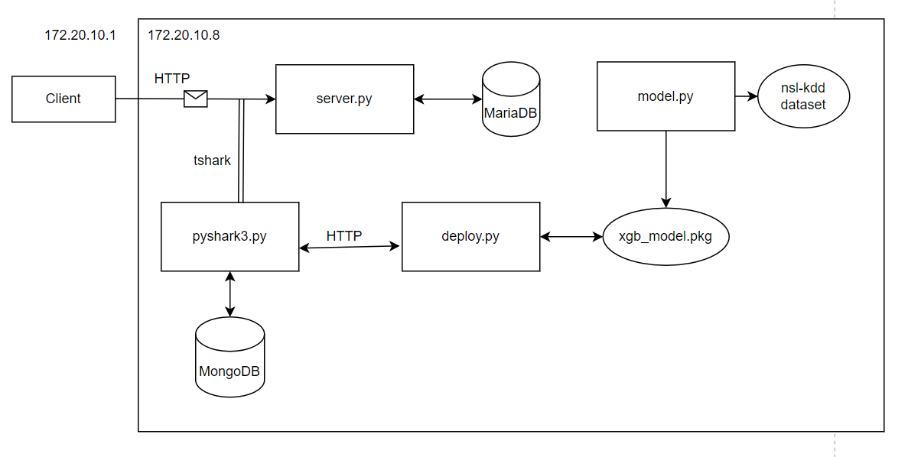

# ABOUT
AI based real time intrusion detection system. 

## Usage
First of all, the client side and server side must be run on different devices. First, the server side will stand up and then you will send requests from the client side. Don't forget to set your IP addresses according to your devices 
you can check ip addresses by using:
```bash
ipconfig
```
and install the required packages (pip install ....). 

```bash
cd server-side
cd server
optional(docker-compose build)
docker-compose run 
docker run -d -p 27017:27017 --name mymongodb mongo

cd /server-side/
py deploy.py
py pyshark3.py
```

send requests from another device with clients specified in /client-side (should be at same LAN interface.)
```bash
py attack-client.py
py regular-client.py
```

## Structure Overview
